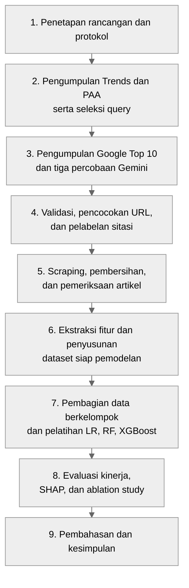
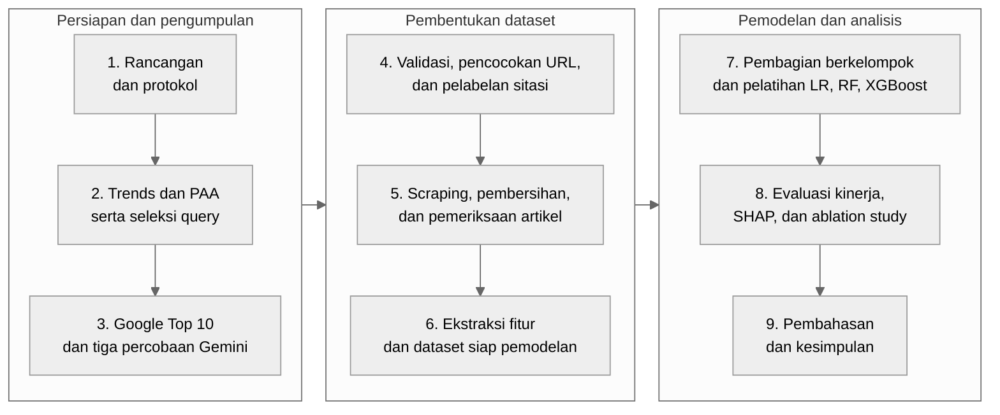
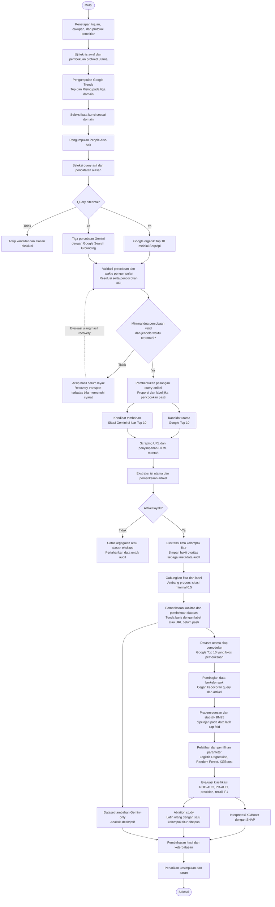

# Flowchart Prosedur Penelitian

Pendamping [outline subbab Prosedur Penelitian](OUTLINE_PROSEDUR_PENELITIAN.md). Disusun 19 September 2026.

Disederhanakan pada 19 September 2026 agar lebih mudah ditempatkan pada satu halaman A4. Pilih satu versi ringkas di bawah untuk laporan; versi detail tetap tersedia sebagai referensi.

Salin isi salah satu blok kode ke Mermaid Live Editor, tanpa tanda pembatas tiga backtick. Diagram menunjukkan prosedur lengkap yang direncanakan, bukan penanda seluruh tahap telah selesai.

## Pilihan 1 — Ringkas vertikal untuk A4 portrait (disarankan)

Versi ini menggunakan sembilan tahap utama. Seleksi, validasi, recovery, dan alasan eksklusi dijelaskan dalam teks metodologi sehingga tidak perlu menjadi cabang tersendiri pada gambar.

## Pilihan 2 — Horizontal tiga kelompok untuk A4 landscape

Sembilan tahap disusun dalam tiga kolom, masing-masing berisi tiga tahap. Susunan ini menghindari satu baris horizontal panjang yang akan membuat tulisan terlalu kecil. Baca tiap kolom dari atas ke bawah, kemudian lanjut ke kolom kanan sesuai nomor tahap.

## Keterangan untuk kedua versi ringkas

- LR: Logistic Regression; RF: Random Forest.
- Tahap 1 mencakup uji teknis awal dan pembekuan protokol utama.
- Tahap 4 mempertahankan ketentuan minimal dua percobaan valid, jendela pengumpulan, label dengan ambang proporsi ≥0,5, dan penanganan ketidakpastian URL.
- Tahap 6 memisahkan dataset utama Google Top 10 untuk model dari dataset tambahan Gemini-only untuk analisis deskriptif.
- Tahap 7 mencakup pencegahan kebocoran data, prapemrosesan, penghitungan ulang statistik BM25 dari korpus latih setiap fold, serta pemilihan hiperparameter.
- Tahap 8 mencakup evaluasi model dan pelatihan ulang pada setiap konfigurasi ablation. Tahap 9 juga menggunakan analisis deskriptif dataset tambahan.

**Usulan caption:** Gambar X. Prosedur penelitian klasifikasi keterkutipan artikel web berbahasa Indonesia oleh Gemini.

Untuk laporan dengan orientasi portrait tetap, gunakan pilihan 1. Jika pedoman kampus mengizinkan halaman landscape, pilihan 2 dapat memakai lebar halaman. Ekspor sebagai SVG agar teks tetap tajam saat diubah ukurannya. Sesuaikan ukuran akhir dengan area cetak setelah margin dan caption; keterbacaan perlu diperiksa pada ukuran cetak sebenarnya.

## Versi detail — Referensi, bukan gambar utama satu halaman

## Catatan pembacaan

- Cabang Google dan Gemini merupakan dua sumber pengumpulan untuk query yang sama; diagram tidak mensyaratkan eksekusi paralel.
- Recovery hanya untuk kegagalan transport yang memenuhi aturan retry dan jendela waktu, bukan mengulang jawaban valid sampai mendapat label yang diinginkan.
- Ketidakpastian pencocokan URL tetap disimpan dan tidak diubah menjadi label negatif.
- Dataset utama adalah kandidat Google Top 10; Gemini-only digunakan untuk analisis tambahan.
- Statistik BM25 pada tahap pemodelan dihitung dari data latih tiap fold, meskipun skor awal sudah tersedia dalam dataset hasil build.
- Ablation menggunakan pembagian data dan prosedur evaluasi yang sama dengan eksperimen fitur lengkap.
